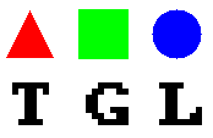

# ToyGL
TGL is an implementation of a *simple* software renderer, as a lightweight library.
Features:
- Textures
- Single header
- Lightweight
- No dependencies
- Objectively better than Chad Engine

### Building
TGL is a single header library - there is nothing to build.
But if you realy want to build something, you can compile the examples in `./src/examples/`,
but note that they are generally poorly written. To do this open the src directory and run `./build.sh <example>` (or `build.bat <example>` on windows) where `<example>` is the name of the example program to compile and run - `blocks`, `cubes` or `game`.

  

